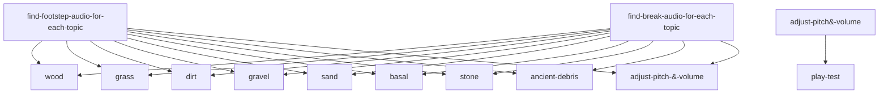

<h1 align = "center">   <strong>NADIRS</strong>
</h1>
<h3 align = "center">NISO, or Noirvaze's Immersive Sounds Overhaul, is a sound overhaul, completely changing all audio to a realistic version. Having inspiration from both Java mods, named Presence Foostetps, Sounds and Quality Sounds. since there isnt that many great audio overhaul mods on Bedrock, and its unfair where Java has way better mods than Bedrock, so I decided to make NISO!</h3>

> NISO is not finished yet, everything is subject to change.

> [!NOTE]
> This is a *very verrrry* early alpha stage of NISO and there are still missing audios.
> 
## progress board

| Tasks | Finished? | Notes |
| :---         |     :---:      |          ---: |
| find-footstep-audio-for-each-topic   | Work in Progress     | it will take awhile to find for each topic, especially since I'm doing this solo    |
| find-break-audio-for-each-topic    | No       | once I finish finding footstep audio, I'll switch to finding break audio.      |
| adjust pitch & volume | No | not there yet |
| play test | No | not there yet. |
### Commits
Alternatively, you can just view my recent commits and see what has changed in detail. and also revert to an older version.

# Download, Installation & Compatibility
Below is information about installing and compatibility.

## Minecraft version and Compatibility
For NISO to work, you <ins>must</ins> have:
> - Minecraft Bedrock Edition ( Windows, IOS or Android )
> - Version 1.0.4 and up for Minecraft to have access to custom sounds.

## Installation
Unlike Java, Bedrock edition has a way easier way of importing and installing resource packs. _It doesnt require anything else!_

1. Download the latest release in the [Release page](https://github.com/noirvaze/NISO/releases)
2. Go to the downloaded mcpack and click it, if nothing happens, share it to Minecraft to open it on Minecraft
3. done! just go to your global resources or open an existing/create a new one, and activate it!
_Enjoy your new immersive experience. If you have headphones, use them for the best experience! just make sure the volume isnt too high._

### Downloads
- [Releases](https://github.com/noirvaze/NADIRS/releases)

# Credits
[Zapslat](https://www.zapsplat.com/) - The website that Quality sounds, sounds and presence footsteps used for their own sound effects. I try to not pay for premium plans for audios, since im a young yet solo developer.
[Pixabay](https://pixabay.com/sound-effects/) - An extra website to find sound effects, since I mention I didn't pay for the premium plans on Zapslat, I am limited to some packs and sound effects. 
all credits go to them and the creators in Pixabay for the free sound effects, without them, Presence footsteps, Sounds and quality sounds wouldn't exist and neither would NISO.
[Pinterest](https://ca.pinterest.com/) - The background for NISO's icon is from Pinterest, the text was editing using [Photopea](https://www.photopea.com/).
# Have Questions?

### Discord

### Email

