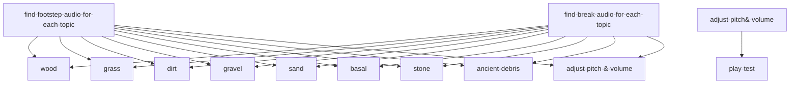

> [!NOTE]
> This is a *very verrrry* early alpha stage of NISO and there are still missing audios.
> 
# NADIRS
NISO, or Noirvaze's Immersive Sounds Overhaul, is a sound overhaul, completely changing all audio to a realistic version. Having inspiration from both Java mods, named Sounds and Quality Sounds. since there isntthat many great audio overhaul mods on Bedrock, and its unfair where Java has way better mods than Bedrock, so I decided to make NISO!
> NISO is not finished yet, everything is subject to change.

## progress board

| Tasks | Finished? | Notes |
| :---         |     :---:      |          ---: |
| find-footstep-audio-for-each-topic   | Work in Progress     | it will take awhile to find for each topic, especially since im doing this solo    |
| find-break-audio-for-each-topic    | No       | once i finish finding footstep audio, i'll switch to finding break audio.      |
| adjust pitch & volume | No | not there yet |
| play test | No | not there yet. |
### Commits
Alternatively, you can just view my recent commits and see what has changed in detail. and also revert to an older version.

# Download, Installation & Compatability
Below is information about installling and compatability.

## Minecraft version and Compatability
For NISO to work, you <ins>must</ins> have:
> - Mincraft Bedrock Edition ( Windows, IOS or Android )
> - Version 1.0.4 and up for Minecraft to have access to custom sounds.

## Installation
Unlike Java, Bedrock edition has a way easier way of importing and installing resource packs. _It doesnt require anything else!_

1. Download the latest release in the [Release page](https://github.com/noirvaze/NADIRS/releases)
2. Go to the downloaded mcpack and click it, if nothing happens, share it to minecraft to open it on minecraft
3. done! just go to your global resources or open an existing/create a new one, and activate it!
_Enjoy your new experience._

### Downloads
- [Releases](https://github.com/noirvaze/NADIRS/releases)

### if you have any questions, please contact me through discord ( @noir_studios ) or email ( noirvaze@icloud.com )
